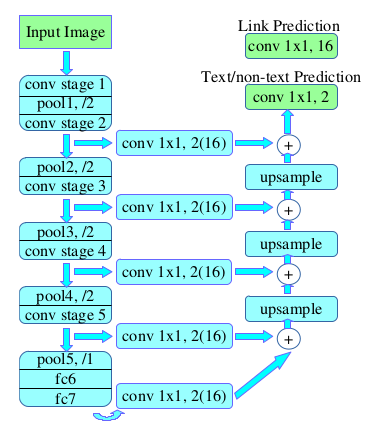

## PixelLink in Keras

For a deeper understanding the text detection alg called PixelLink, so I implemented the network model in keras just for testing.

### prerequisites
- python 3.6
- keras 2.2.0
- opencv 3.4.2

### need to know...
The original PixelLink model trained with tensorflow, I converted the TF CHECKPOINTs(only [PixelLink + VGG16 4s](https://drive.google.com/file/d/19mlX5W8OBalSjhf5oTTS6qEq2eAU8Tg9/view?usp=sharing)) into keras H5 weights, and you can download from [here](https://drive.google.com/file/d/1MK0AkvBMPZ-VfKN5m4QtSWWSUqoMHY33/view?usp=sharing).
Due to limited time, I've just implemented the model structure and testing process.

any suggestions are welcomed!

example:

### references

-  [(paper) PixelLink: Detecting Scene Text via Instance Segmentation](https://arxiv.org/abs/1801.01315)
- [(repo) pixel_link](https://github.com/ZJULearning/pixel_link)
